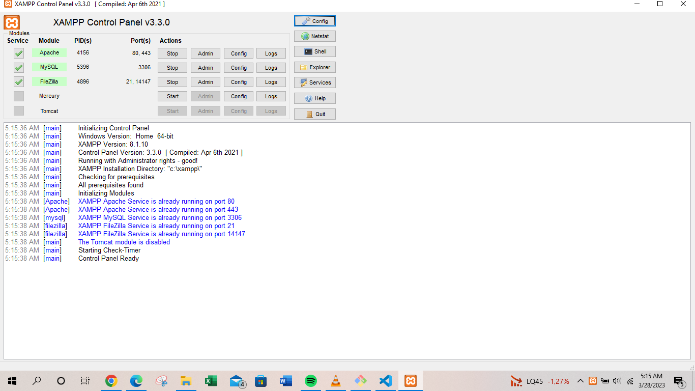
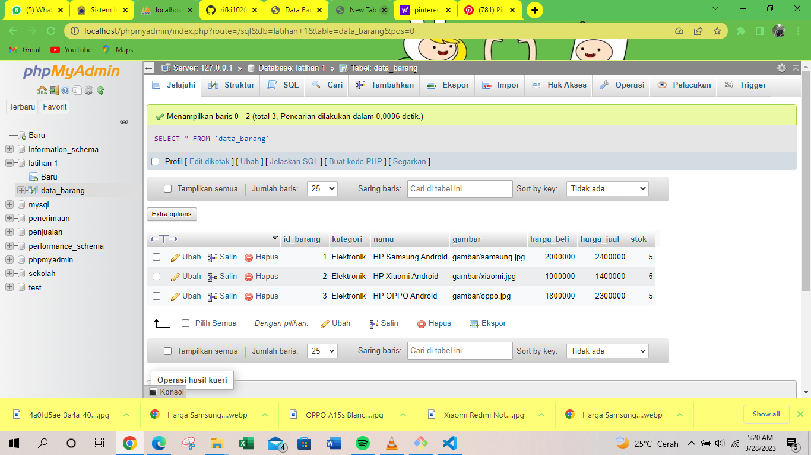
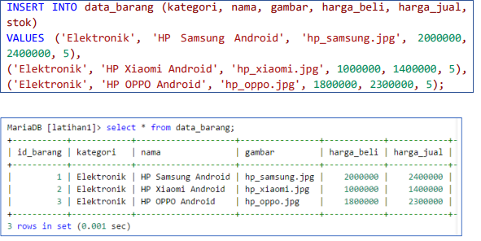
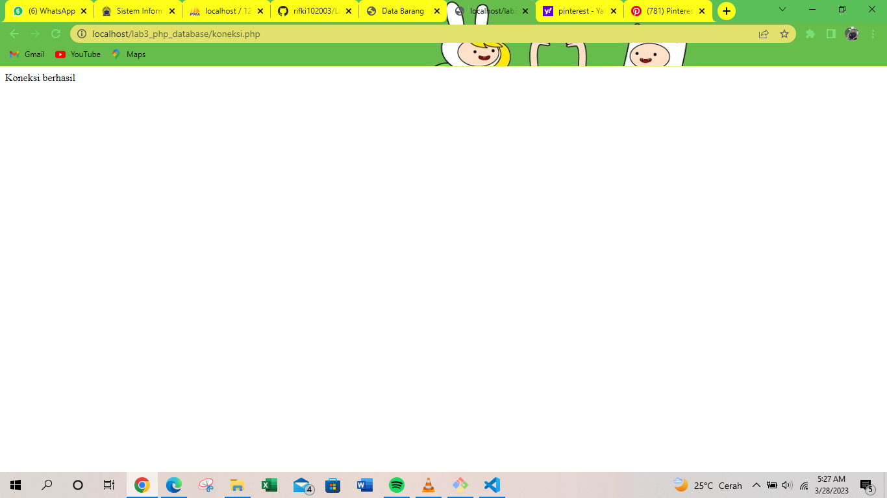
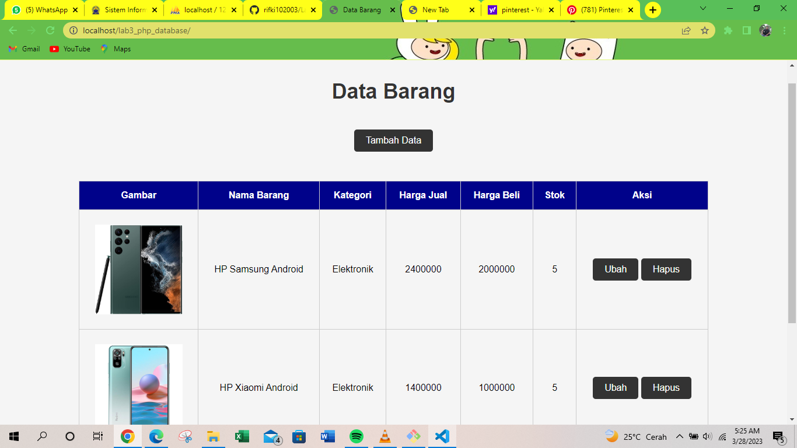
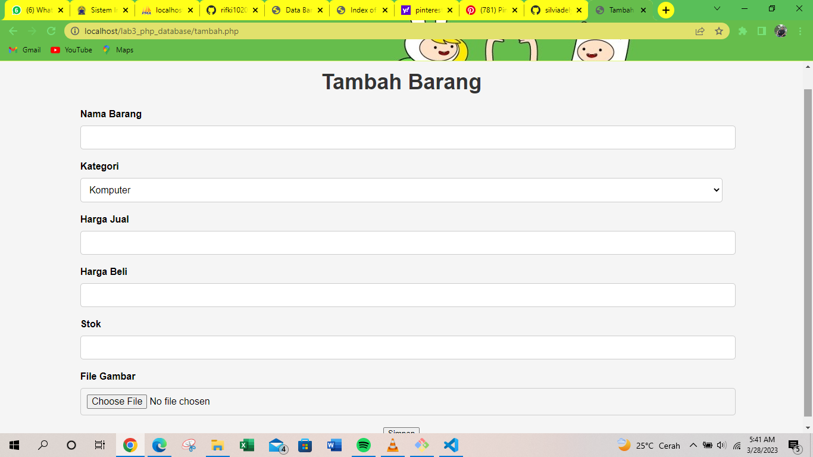
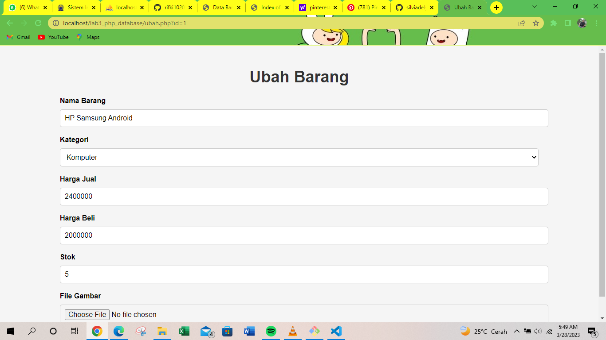
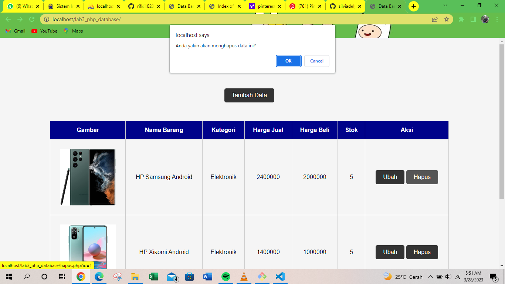

# Lab3Web
| #               | Data diri                    |
| --------------- | ---------------------------- |
| **Nama**        | Muhamad Rifki   |
| **NIM**         | 321******                    |
| **Kelas**       | TI.21.A.1                    |
| **Mata Kuliah** | Pemrograman Web 2            |

## Langkah-langkah Praktikum
# Persiapan

Untuk memulai membuat aplikasi CRUD sederhana, yang perlu disiapkan adalah database server 
menggunakan MySQL. Pastikan MySQL Server sudah dapat dijalankan melalui XAMPP.
Menjalankan MySQL Server
Untuk menjalankan MySQL Server dari menu XAMPP Contol.

Mengakses MySQL Client menggunakan PHP MyAdmin
Pastikan webserver Apache dan MySQL server sudah dijalankan. Kemudian buka melalui browser: 
http://localhost/phpmyadmin/ 

# Membuat Database
    CREATE DATABASE latihan1;
# Membuat Tabel
        CREATE TABLE data_barang (
        id_barang int(10) auto_increment Primary Key,
        kategori varchar(30),
        nama varchar(30),
        gambar varchar(100),
        harga_beli decimal(10,0),
        harga_jual decimal(10,0),
        stok int(4)
        );

# Menambahkan Data

# Membuat Program CRUD
Buat folder lab3_php_database pada root directory web server (c:\xampp\htdocs)

Kemudian untuk mengakses direktory tersebut pada web server dengan mengakses URL: 
http://localhost/lab3_php_database/

# Membuat file koneksi database
Buat file baru dengan nama koneksi.php

        <?php
        $host = "localhost";
        $user = "root";
        $pass = "";
        $db = "latihan 1";
        $conn = mysqli_connect($host, $user, $pass, $db);
        if ($conn == false)
        {
        echo "Koneksi ke server gagal.";
        die();
        } else echo "Koneksi berhasil";
        ?>

# Membuat file index untuk menampilkan data (Read)
Buat file baru dengan nama index.php

                <?php
                include_once("koneksi.php");
                // query untuk menampilkan data
                $sql = 'SELECT * FROM data_barang';
                $result = mysqli_query($conn, $sql);
                ?>

                <!DOCTYPE html>
                <html lang="en">
                <head>
                    <meta charset="UTF-8">
                    <link href="style.css" rel="stylesheet" type="text/css" />
                    <title>Data Barang</title>
                </head>
                <body>
                    

                        <h1>Data Barang</h1>
                        

                            <table>
                            <a href="tambah.php">Tambah Data</a>
                                <tr>
                                    <th>Gambar</th>
                                    <th>Nama Barang</th>
                                    <th>Kategori</th>
                                    <th>Harga Jual</th>
                                    <th>Harga Beli</th>
                                    <th>Stok</th>
                                    <th>Aksi</th>
                                </tr>
                                <?php if ($result) : ?>
                                    <?php while ($row = mysqli_fetch_array($result)) : ?>
                                        <tr>
                                            <td>" alt="<?= $row['nama']; ?>"></td>
                                            <td><?= $row['nama']; ?></td>
                                            <td><?= $row['kategori']; ?></td>
                                            <td><?= $row['harga_jual']; ?></td>
                                            <td><?= $row['harga_beli']; ?></td>
                                            <td><?= $row['stok']; ?></td>
                                            <td>
                                                <a href="ubah.php?id=<?= $row['id_barang']; ?>">Ubah</a> 
                                                <a href="hapus.php?id=<?= $row['id_barang']; ?>" onclick="return confirm('Anda yakin akan menghapus data ini?')">Hapus</a>
                                            </td>
                                        </tr>
                                    <?php endwhile;
                                else : ?>
                                    <tr>
                                        <td colspan="7">Belum ada data</td>
                                    </tr>
                                <?php endif; ?>
                            </table>
                        

                    

                </body>
                </html>
# Muncul seperti ini

# Menambah Data (Create)

Buat file baru dengan nama tambah.php

                    <?php
        error_reporting(E_ALL);
        include_once 'koneksi.php';
        if (isset($_POST['submit'])) {
            $nama = $_POST['nama'];
            $kategori = $_POST['kategori'];
            $harga_jual = $_POST['harga_jual'];
            $harga_beli = $_POST['harga_beli'];
            $stok = $_POST['stok'];
            $file_gambar = $_FILES['file_gambar'];
            $gambar = null;
            if ($file_gambar['error'] == 0) {
                $filename = str_replace(' ', '_', $file_gambar['name']);
                $destination = dirname(__FILE__) . '/gambar/' . $filename;
                if (move_uploaded_file($file_gambar['tmp_name'], $destination)) {
                    $gambar = 'gambar/' . $filename;;
                }
            }
            $sql = 'INSERT INTO data_barang (nama, kategori,harga_jual, harga_beli, 
        stok, gambar) ';
            $sql .= "VALUE ('{$nama}', '{$kategori}','{$harga_jual}', 
        '{$harga_beli}', '{$stok}', '{$gambar}')";
            $result = mysqli_query($conn, $sql);
            header('location: index.php');
        }
       
        ?>
        <!DOCTYPE html>
        <html lang="en">

        <head>
            <meta charset="UTF-8">
            <link href="style.css" rel="stylesheet" type="text/css" />
            <title>Tambah Barang</title>
        </head>

        <body>
            

                <h1>Tambah Barang</h1>
                

                    <form method="post" action="tambah.php" enctype="multipart/formdata">
                        

                            <label>Nama Barang</label>
                            <input type="text" name="nama" />
                        

                        

                            <label>Kategori</label>
                            <select name="kategori">
                                <option value="Komputer">Komputer</option>
                                <option value="Elektronik">Elektronik</option>
                                <option value="Hand Phone">Hand Phone</option>
                            </select>
                        

                        

                            <label>Harga Jual</label>
                            <input type="text" name="harga_jual" />
                        

                        

                            <label>Harga Beli</label>
                            <input type="text" name="harga_beli" />
                        

                        

                            <label>Stok</label>
                            <input type="text" name="stok" />
                        

                        

                            <label>File Gambar</label>
                            <input type="file" name="file_gambar" />
                        

                        

                            <input type="submit" name="submit" value="Simpan" />
                        

                    </form>
                

            

        </body>
        </html>

# Mengubah Data (Update)

Buat file baru dengan nama ubah.php

        <?php
    error_reporting(E_ALL);
    include_once 'koneksi.php';
    if (isset($_POST['submit'])) {
        $id = $_POST['id'];
        $nama = $_POST['nama'];
        $kategori = $_POST['kategori'];
        $harga_jual = $_POST['harga_jual'];
        $harga_beli = $_POST['harga_beli'];
        $stok = $_POST['stok'];
        $file_gambar = $_FILES['file_gambar'];
        $gambar = null;

        if ($file_gambar['error'] == 0) {
            $filename = str_replace(' ', '_', $file_gambar['name']);
            $destination = dirname(__FILE__) . '/gambar/' . $filename;
            if (move_uploaded_file($file_gambar['tmp_name'], $destination)) {
                $gambar = 'gambar/' . $filename;;
            }
        }
        $sql = 'UPDATE data_barang SET ';
        $sql .= "nama = '{$nama}', kategori = '{$kategori}', ";
        $sql .= "harga_jual = '{$harga_jual}', harga_beli = '{$harga_beli}', 
    stok = '{$stok}' ";
        if (!empty($gambar))
            $sql .= ", gambar = '{$gambar}' ";
        $sql .= "WHERE id_barang = '{$id}'";
        $result = mysqli_query($conn, $sql);
        header('location: index.php');
    }
    $id = $_GET['id'];
    $sql = "SELECT * FROM data_barang WHERE id_barang = '{$id}'";
    $result = mysqli_query($conn, $sql);
    if (!$result) die('Error: Data tidak tersedia');
    $data = mysqli_fetch_array($result);
    function is_select($var, $val)
    {
        if ($var == $val) return 'selected="selected"';
        return false;
    }
    ?>
        <!DOCTYPE html>
        <html lang="en">

    <head>
        <meta charset="UTF-8">
        <link href="style.css" rel="stylesheet" type="text/css" />
        <title>Ubah Barang</title>
    </head>

    <body>
        

            <h1>Ubah Barang</h1>
            

                <form method="post" action="ubah.php" enctype="multipart/form-data">
                    

                        <label>Nama Barang</label>
                        <input type="text" name="nama" value="<?php echo $data['nama']; ?>" />
                    

                    

                        <label>Kategori</label>
                        <select name="kategori">
                            <option <?php echo is_select('Komputer', $data['kategori']); ?> value="Komputer">Komputer</option>
                            <option <?php echo is_select('Komputer', $data['kategori']); ?> value="Elektronik">Elektronik</option>
                            <option <?php echo is_select('Komputer', $data['kategori']); ?> value="Hand Phone">Hand Phone</option>
                        </select>
                    

                    

                        <label>Harga Jual</label>
                        <input type="text" name="harga_jual" value="<?php echo $data['harga_jual']; ?>" />
                    

                    

                        <label>Harga Beli</label>
                        <input type="text" name="harga_beli" value="<?php echo $data['harga_beli']; ?>" />
                    

                    

                        <label>Stok</label>
                        <input type="text" name="stok" value="<?php echo $data['stok']; ?>" />
                    

                    

                        <label>File Gambar</label>
                        <input type="file" name="file_gambar" />
                    

                    

                        <input type="hidden" name="id" value="<?php echo $data['id_barang']; ?>" />
                        <input type="submit" name="submit" value="Simpan" />
                    

                </form>
            

        

    </body>
    </html>

# Menghapus Data (Delete)

Buat file baru dengan nama hapus.ph

    
    <?php
    include_once 'koneksi.php';
    $id = $_GET['id'];
    $sql = "DELETE FROM data_barang WHERE id_barang = '{$id}'";
    $result = mysqli_query($conn, $sql);
    header('location: index.php');
    ?>

